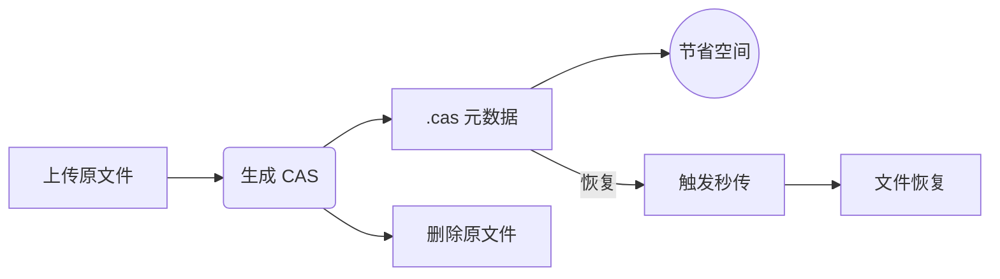

<div align="center">
  

  <p><strong>让大文件“只占 KB 空间”，却随时满血复活。</strong></p>

  <p><em>OpenList 的增强分支，专为 <strong>.cas 秒传元数据工作流</strong> 打造。</em></p>

  
  <a href="https://github.com/OpenListTeam/OpenList/blob/main/LICENSE"></a>
  <a href="https://github.com/OpenListTeam/OpenList/actions"></a>
  <a href="https://github.com/OpenListTeam/OpenList/releases"></a>
  <a href="https://github.com/OpenListTeam/OpenList/discussions"></a>
  <a href="https://github.com/OpenListTeam/OpenList/releases"></a>
</div>

---

# OpenList-CAS

基于 [OpenList](https://github.com/OpenListTeam/OpenList) 的增强分支，围绕 `.cas` 秒传元数据工作流进行优化，实现
**“仅用 KB 存储大文件 + 秒级恢复”** 的高效云盘方案。

---

## ✨ TL;DR

* 📦 上传一次 → 永久可恢复（无需重复上传）
* 💾 存储占用降低 99%+（GB → KB）
* ⚡ 秒级恢复大文件（依赖云盘秒传能力）

---

## 🧠 核心理念

> 用“文件特征”代替“文件本体”存储

通过 `.cas` 元数据实现：

* 删除原始大文件
* 保留恢复能力
* 极限压缩存储占用

---

## 🔄 工作流程

一句话：

> 上传 → 提取特征 → 删除原文件 → 需要时秒传恢复



---

## 🚀 使用场景

* 📉 **低存储环境（VPS / NAS）**
  仅保存 `.cas`，极大减少空间占用

* ☁️ **网盘秒传优化**
  利用哈希直接恢复文件，避免重复上传

* 🎬 **媒体库归档**
  平时只存元数据，需要时恢复原文件

* 🔁 **自动化工作流**
  监控 `.cas` 文件并自动恢复

---

## 🔧 核心特性

* 自动生成 `.cas` 元数据文件
* 支持生成后删除原文件（极限节省空间）
* 支持通过 `.cas` 秒传恢复文件
* 支持重命名 `.cas` 后恢复
* 支持自动监听并恢复 `.cas`

---

## 📦 支持驱动

| 驱动         | 支持情况 | 推荐    | 说明       |
| ---------- | ---- | ----- | -------- |
| 189Cloud   | ✅    | ⭐⭐⭐⭐⭐ | 完整支持     |
| 189CloudPC | ✅    | ⭐⭐⭐⭐⭐ | 完整支持     |
| Local      | ⚠️   | ⭐⭐    | 仅生成 / 删除 |

---

## ⚙️ 配置说明

| 配置项                             | 默认值 | 适用驱动     | 说明             |
| ------------------------------- | --- | -------- | -------------- |
| Generate cas                    | ❌   | 全部       | 上传后生成 `.cas`   |
| Delete source                   | ❌   | 全部       | 生成后删除原文件       |
| Restore source from cas         | ❌   | 189Cloud | 通过 `.cas` 恢复文件 |
| Restore source use current name | ❌   | 189Cloud | 使用当前文件名恢复      |
| Delete CAS after restore        | ❌   | 189Cloud | 恢复后删除 `.cas`   |
| Auto restore existing cas       | ❌   | 189Cloud | 自动监听恢复         |
| Auto restore existing cas paths | -   | 189Cloud | 指定监听目录         |

---

### 👉 推荐配置（低存储模式）

开启：

* ✅ Generate cas
* ✅ Delete source

效果：

```text
movie.mp4 → movie.mp4.cas
（原文件删除，仅保留 .cas）
```

---

## 🏷️ 命名规则

开启 **使用当前文件名恢复**：

| 操作        | 结果             |
| --------- | -------------- |
| a.mp4.cas | → a.mp4        |
| a.cas     | → a.mp4（自动补后缀） |

关闭该选项：

* 使用 `.cas` 内记录的原始文件名

---

## 🖥️ 本地存储说明（Local）

支持：

* 生成 `.cas`
* 删除原文件

不支持：

* 秒传恢复

---

## 🐳 部署指南

💡 默认端口：5244
💡 数据目录：/opt/openlist/data
💡 首次启动需获取管理员密码

---

### Docker

```bash
docker run -d --restart=unless-stopped \
  -v /etc/openlist:/opt/openlist/data \
  -p 5244:5244 \
  -e PUID=0 \
  -e PGID=0 \
  -e UMASK=022 \
  --name="openlist-cas" \
  freeyua/openlist-cas:latest
```

---

### Docker Compose

```yaml
services:
  openlist-cas:
    image: freeyua/openlist-cas:latest
    container_name: openlist-cas
    restart: unless-stopped
    ports:
      - "5244:5244"
    volumes:
      - ./data:/opt/openlist/data
    environment:
      - PUID=0
      - PGID=0
      - UMASK=022
```

---

## 🌐 访问

```
http://localhost:5244
```

---

## ⚠️ 重要认知（必读）

### ❗ `.cas` ≠ 数据备份

`.cas` 只是文件的“特征索引”，并不包含实际数据：

* ✔ 可恢复：云盘仍存在该文件（可命中秒传）
* ❌ 不可恢复：云盘文件被删除 / 失效 / 风控

👉 **请勿将 `.cas` 作为唯一备份方案**

---

## ⚠️ 风险提示

* 强依赖云盘秒传能力
* 云盘策略变化可能影响恢复
* 不适用于长期数据唯一存储

---

## ❓ 常见问题

### ❗ 上传 `.cas` 没反应

未开启 `Restore source from cas`

### ❗ 无法恢复文件

驱动不支持或云端无匹配文件

### ❗ 文件名不正确

检查 `Restore source use current name`

### ❗ `.cas` 是备份吗？

不是，仅为索引

---

## 🔗 与上游项目

* 上游：OpenList
* 基线版本：v4.2.1
* 本项目为非官方增强分支

---

## 📜 免责声明

1. 本项目仅用于学习与研究
2. 请遵守相关法律法规
3. 禁止用于非法用途
4. 使用风险由用户自行承担

---

## 🙏 致谢

感谢 OpenList 提供基础能力

---

## ⭐ Star History

如果这个项目帮到了你，欢迎点个 ⭐ 支持！
