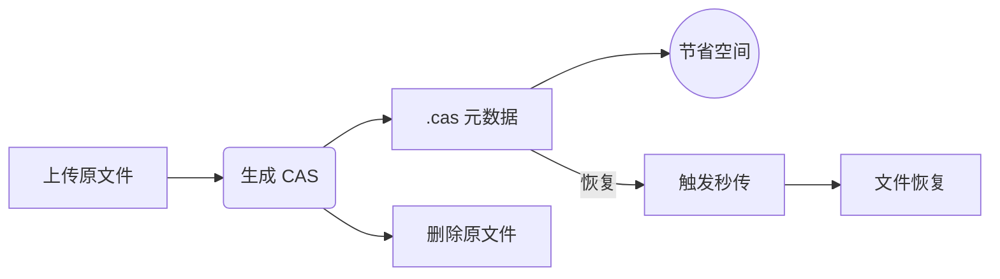

<div align="center">
  

  <p><em>OpenList 是一个有韧性、长期治理、社区驱动的 AList 分支，旨在防御基于信任的开源攻击。</em></p>

  
  <a href="https://github.com/OpenListTeam/OpenList/blob/main/LICENSE"></a>
  <a href="https://github.com/OpenListTeam/OpenList/actions?query=workflow%3ABuild"></a>
  <a href="https://github.com/OpenListTeam/OpenList/releases"></a>

  <a href="https://github.com/OpenListTeam/OpenList/discussions"></a>
  <a href="https://github.com/OpenListTeam/OpenList/releases"></a>
</div>

---

# OpenList-CAS

  <p><em>基于 OpenList 增强，专为 <strong>.cas 秒传元数据工作流</strong> 打造的高效云盘方案。</em></p>

---

## ✨ TL;DR（你能获得什么？）

* 📦 **上传一次 → 永久可恢复**（无需重复上传）
* 💾 **存储占用降低 99%+**（GB → KB）
* ⚡ **秒级恢复大文件**（依赖云盘秒传能力）

---

## 🧠 核心理念

> **用“文件特征”代替“文件本体”存储**

OpenList-CAS 通过提取文件哈希生成 `.cas` 元数据，使你可以：

* 删除原始大文件
* 仅保留 KB 级 `.cas`
* 在需要时通过云盘秒传恢复

---

## 🔄 工作流程

一句话版本：

> 上传 → 提取特征 → 删除原文件 → 需要时秒传恢复



---

## 🚀 使用场景

### 📉 低配服务器救星

* VPS / NAS 只有几十 GB？
* 用 `.cas` 挂海量资源

### 🎬 媒体库归档神器

* 看完即删原片
* 保留 `.cas` 作为“可恢复索引”

### 🔁 自动化工作流

* 配合脚本自动恢复 / 刮削
* 构建“按需加载媒体库”

---

## 📦 支持驱动

| 存储驱动       | 状态 | 推荐    | 说明               |
| ---------- | -- | ----- | ---------------- |
| 189Cloud   | ✅  | ⭐⭐⭐⭐⭐ | 完整支持（推荐）         |
| 189CloudPC | ✅  | ⭐⭐⭐⭐⭐ | 完整支持             |
| Local      | ⚠️ | ⭐⭐    | 仅生成 `.cas`，不支持秒传 |

---

## ⚙️ 配置说明

| 配置项                             | 默认 | 说明             |
| ------------------------------- | -- | -------------- |
| Generate cas                    | ❌  | 上传后生成 `.cas`   |
| Delete source                   | ❌  | 生成后删除原文件（推荐开启） |
| Restore source from cas         | ❌  | 允许 `.cas` 恢复文件 |
| Restore source use current name | ❌  | 使用当前文件名恢复      |
| Delete CAS after restore        | ❌  | 恢复后删除 `.cas`   |
| Auto restore existing cas       | ❌  | 自动监听并恢复        |

---

## 🐳 部署指南（Docker）

### 1️⃣ docker-compose.yml

```yaml
services:
  openlist-cas:
    image: freeyua/openlist-cas:latest
    container_name: openlist-cas
    restart: unless-stopped
    ports:
      - "5244:5244"
    volumes:
      - ./data:/opt/openlist/data
```

启动：

```bash
docker compose up -d
```

---

### 2️⃣ 获取管理员密码

```bash
docker exec -it openlist-cas ./openlist admin
```

---

### 3️⃣ 访问面板

```
http://服务器IP:5244
```

---

## ⚠️ 重要认知（必读）

### ❗ `.cas` ≠ 备份

`.cas` 只是“文件索引”，不是数据本身：

* ✔ 能恢复：云盘仍有该文件哈希
* ❌ 不能恢复：云盘清理 / 失效

👉 **请勿把 `.cas` 当作数据备份使用**

---

## ⚠️ 风险提示

* 强依赖云盘秒传机制
* 云盘策略变化可能影响恢复
* 不适用于长期数据保留（除非有冗余）

---

## ❓ FAQ

**Q: 上传 `.cas` 没反应？**
A: 检查是否开启 `Restore source from cas`

**Q: 文件名不对？**
A: 关闭 `Restore source use current name`

**Q: 本地存储能秒传吗？**
A: 不能（无哈希匹配能力）

---

## 📜 致谢 & 声明

* 感谢 OpenList 提供基础框架
* 本项目为非官方增强分支

⚠️ **仅供学习研究，请遵守法律法规**

---

## ⭐ Star History（建议加）

如果这个项目帮到了你，欢迎点个 ⭐ 支持！
